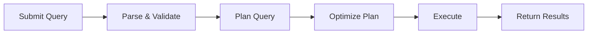
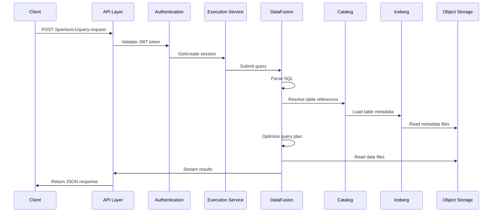

Embucket is a single-binary lakehouse that provides a wire-compatible Snowflake replacement built on proven open source technologies. This page explains how the system components work together to execute queries on your data lake.

## System Overview

Embucket follows a **query-per-node** architecture where each instance handles complete queries independently, from API request to result delivery. This design enables horizontal scaling by simply adding more nodes for increased throughput.

<CardGroup cols={2}>
  <Card title="Query Engine" icon="gears">
    Apache DataFusion powers SQL execution with query planning and optimization
  </Card>
  <Card title="Storage Layer" icon="database">
    Apache Iceberg provides ACID transactions and time travel on your data lake
  </Card>
  <Card title="API Layer" icon="plug">
    Snowflake-compatible REST API for seamless client integration
  </Card>
  <Card title="Catalog" icon="book">
    Metastore manages database, schema, and table metadata
  </Card>
</CardGroup>

## Core Components

### API Layer (`api-snowflake-rest`)

The API layer implements the Snowflake SQL REST API v1, enabling compatibility with existing Snowflake clients, SDKs, and tools.

**Key endpoints:**
- `/session/v1/login-request` - Authentication and session creation
- `/queries/v1/query-request` - Query submission and execution
- `/queries/v1/abort-request` - Query cancellation
- `/session` - Session management

**Implementation details:**
- JWT-based authentication with configurable token expiration (default: 3 days)
- Session state tracking with automatic expiration
- Request compression and decompression support
- Snowflake-compatible response formatting (JSON)

See `crates/api-snowflake-rest/src/server/router.rs:24` for the router implementation.

### Execution Service (`executor`)

The execution service (`CoreExecutionService`) orchestrates query execution using Apache DataFusion as the underlying query engine.

**Core responsibilities:**
- Session lifecycle management with expiration tracking
- Query submission, execution, and result delivery
- Concurrent query management with configurable limits (default: 100)
- Query timeout enforcement (default: 20 minutes)
- Memory and disk resource pool management

**Query execution flow:**



1. **Submit**: Query accepted and assigned a unique ID
2. **Parse**: SQL parsed using Snowflake dialect extensions
3. **Plan**: DataFusion creates logical plan from AST
4. **Optimize**: Query optimizer applies rules and rewrites
5. **Execute**: Physical plan executed with streaming results
6. **Return**: Results formatted and returned to client

The service implements async execution with cancellation support via tokio CancellationTokens (see `crates/executor/src/service.rs:586`).

### Catalog System (`catalog`)

The catalog system bridges Embucket's metastore and DataFusion's catalog interface, enabling query engine access to metadata.

**Catalog hierarchy:**
```
EmbucketCatalogList (root)
  └── CachingCatalog (database/catalog)
      └── CachingSchema (schema)
          └── CachingTable (table/view)
```

**Supported catalog types:**
- **Embucket**: Native catalogs backed by Iceberg tables
- **S3 Tables**: AWS S3 Table Buckets integration
- **Memory**: In-memory catalogs for temporary data

The `CachingTable` wrapper normalizes schema case sensitivity and rewrites queries for Snowflake SQL compatibility (see `crates/catalog/src/table.rs:24`).

### Metastore (`catalog-metastore`)

The metastore manages persistent metadata about databases, schemas, tables, and volumes.

**Key concepts:**
- **Volume**: Storage location configuration (S3, S3 Tables, local file, memory)
- **Database**: Top-level catalog associated with a volume
- **Schema**: Logical grouping of tables within a database
- **Table**: Apache Iceberg table with metadata location pointer

**Configuration example:**
```yaml
volumes:
  - ident: lakehouse
    type: s3
    region: us-east-2
    bucket: my-bucket
databases:
  - ident: demo
    volume: lakehouse
schemas:
  - database: demo
    schema: public
tables:
  - database: demo
    schema: public
    table: customers
    metadata_location: s3://my-bucket/customers/metadata/v1.metadata.json
```

## Query-Per-Node Architecture

Each Embucket instance operates independently without shared state beyond the metastore configuration. This stateless design enables:

**Benefits:**
- Simple horizontal scaling - add nodes behind a load balancer
- No coordination overhead between instances
- Isolated failure domains - one node failure doesn't affect others
- Easy deployment - single binary with no dependencies

**Session state:**
Sessions are local to each node and tracked in memory. JWT tokens contain session metadata, allowing subsequent requests to any node (though session-specific state like temporary tables won't transfer).

**Query execution:**
Each node maintains its own:
- DataFusion session contexts with user session state
- Running query registry for cancellation and monitoring
- Memory and disk resource pools for query execution
- Iceberg table metadata cache

See `crates/executor/src/service.rs:149` for the `CoreExecutionService` implementation.

## Data Flow

End-to-end query execution follows this path:



**Key steps:**

1. **API Request**: Client sends query with JWT token
2. **Authentication**: Token validated and session metadata extracted
3. **Query Submission**: Execution service spawns async task for query
4. **Planning**: DataFusion parses SQL and creates logical plan
5. **Catalog Resolution**: Table references resolved via catalog system
6. **Metadata Loading**: Iceberg table metadata loaded from object storage
7. **Optimization**: DataFusion applies query optimization rules
8. **Execution**: Physical plan reads data files and computes results
9. **Result Formatting**: Arrow RecordBatches converted to Snowflake JSON format
10. **Response**: Results streamed back to client

## Built on Apache DataFusion

Embucket uses [Apache DataFusion](https://datafusion.apache.org/) as its query engine, providing:

- **Vectorized execution**: Columnar processing using Apache Arrow
- **Query optimization**: Cost-based optimizer with 100+ optimization rules
- **Streaming execution**: Memory-efficient result streaming
- **Extensibility**: Custom functions, operators, and plan nodes

**DataFusion integration:**
- Custom SQL parser with Snowflake dialect extensions
- Session state management for user context (database, schema, parameters)
- Physical plan optimization with runtime statistics
- Memory pool configuration for controlled resource usage

See `crates/executor/src/service.rs:232` for RuntimeEnv configuration.

## Resource Management

Embucket provides fine-grained control over resource usage:

**Memory pools:**
- **Fair**: Distributes memory evenly across concurrent queries
- **Greedy**: Allows queries to use maximum available memory
- Optional consumer tracking for monitoring (top 5 consumers)

**Disk spillage:**
- Configurable disk pool size for sort/join operations
- Uses OS temporary directory by default
- Automatic cleanup on query completion

**Concurrency control:**
- Maximum concurrent queries (default: 100)
- Query timeout enforcement (default: 20 minutes)
- Automatic query cancellation on timeout
- Graceful cleanup on abort

Configuration via CLI arguments or environment variables (see `crates/embucketd/src/cli.rs`).

## Next Steps

<CardGroup cols={2}>
  <Card title="Snowflake Compatibility" href="/concepts/snowflake-compatibility" icon="snowflake">
    Learn what Snowflake features are supported
  </Card>
  <Card title="Iceberg Integration" href="/concepts/iceberg-integration" icon="layer-group">
    Understand how Embucket uses Apache Iceberg
  </Card>
</CardGroup>