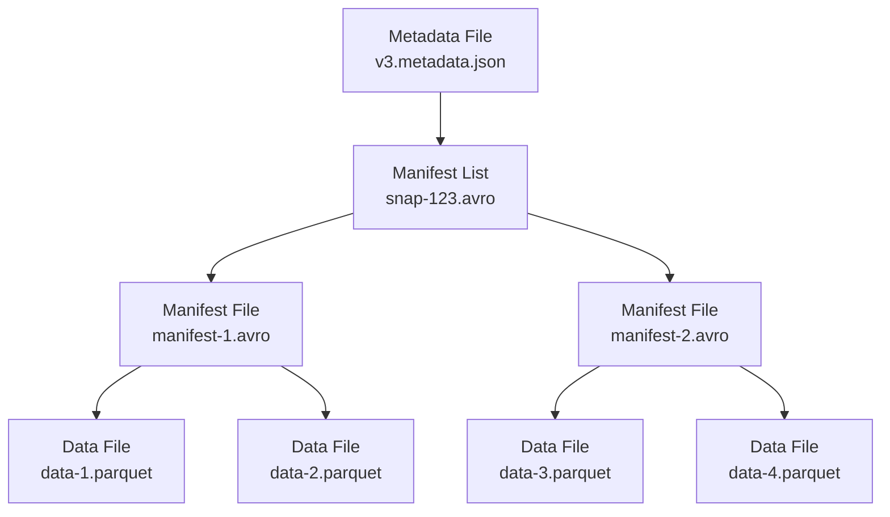

Embucket uses [Apache Iceberg](https://iceberg.apache.org/) as its table format, providing ACID transactions, schema evolution, and time travel capabilities on your data lake. This page explains how Iceberg integrates with Embucket's architecture.

## Why Apache Iceberg?

Apache Iceberg solves critical challenges in data lake architectures:

<CardGroup cols={2}>
  <Card title="ACID Transactions" icon="shield-check">
    Full transactional guarantees for concurrent reads and writes
  </Card>
  <Card title="Schema Evolution" icon="arrows-rotate">
    Add, remove, or rename columns without rewriting data
  </Card>
  <Card title="Time Travel" icon="clock-rotate-left">
    Query historical table snapshots at any point in time
  </Card>
  <Card title="Hidden Partitioning" icon="table-columns">
    Automatic partition pruning without partition filters in queries
  </Card>
  <Card title="Performance" icon="gauge-high">
    Column-level statistics and file-level metrics for query optimization
  </Card>
  <Card title="Vendor Neutral" icon="handshake">
    Open format works with any compute engine (Spark, Trino, Flink, etc.)
  </Card>
</CardGroup>

Embucket reads and writes Iceberg tables natively, allowing you to query the same data with multiple tools without vendor lock-in.

## Iceberg Table Format

An Iceberg table consists of three layers of metadata:



### Metadata File

The metadata file (`*.metadata.json`) is the root pointer for an Iceberg table. It contains:

- **Schema**: Column names, types, and IDs with evolution history
- **Partition spec**: Partitioning strategy (if any)
- **Sort order**: Physical data layout preferences
- **Snapshots**: List of table versions with timestamp and manifest list pointers
- **Current snapshot**: Active table version
- **Properties**: Table configuration (format version, write settings, etc.)

**Example metadata location:**
```
s3://my-bucket/warehouse/db/table/metadata/v3.metadata.json
```

Embucket stores the metadata location in its metastore catalog. When you query a table, Embucket loads this metadata file to understand the table structure.

See `crates/catalog/src/table.rs` for the table loading implementation.

### Manifest List

Each snapshot points to a manifest list (Avro file) that tracks all data files in that version:

- **Manifest files**: List of manifest file locations
- **Partition summaries**: Min/max bounds for each partition
- **Added/deleted files**: Change tracking from previous snapshot

**Query planning:**
When Embucket plans a query, it reads the manifest list to determine which manifest files contain relevant data based on query filters.

### Manifest Files

Manifest files (also Avro) contain detailed information about data files:

- **Data file path**: Location of Parquet file in object storage
- **Partition values**: Values for partitioned columns
- **Record count**: Number of rows in the file
- **File size**: Byte size for I/O estimation
- **Column stats**: Min/max values, null counts, distinct counts
- **Status**: Added, deleted, or existing

**Partition pruning:**
Embucket uses partition values and column statistics to skip reading irrelevant files, dramatically reducing I/O for selective queries.

### Data Files

Data files (typically Parquet) contain the actual table data:

- **Columnar format**: Efficient compression and encoding per column
- **Schema embedded**: Self-describing with column metadata
- **Statistics**: File-level and row-group-level min/max values

Embucket reads data files directly from object storage (S3, GCS, Azure, etc.) using the `object_store` library.

## ACID Guarantees

Iceberg provides full ACID (Atomicity, Consistency, Isolation, Durability) guarantees:

### Atomicity

**All-or-nothing commits:**
Changes to a table are committed atomically by writing a new metadata file. If the commit fails (e.g., network error), the old metadata remains unchanged and no partial state is visible.

```sql
-- This entire operation succeeds or fails atomically
INSERT INTO customers SELECT * FROM staging.new_customers;
```

Embucket leverages Iceberg's atomic commit protocol in `crates/executor/src/query.rs` during write operations.

### Consistency

**Snapshot isolation:**
Each snapshot represents a consistent view of the table at a specific point in time. Queries always see a single consistent snapshot, even if concurrent writes are occurring.

**Schema consistency:**
Schema changes are versioned and tracked. Old snapshots continue to use their original schema, enabling time travel queries.

### Isolation

**Optimistic concurrency control:**
Iceberg uses optimistic locking for concurrent writes. Multiple writers can commit changes to the same table, with the catalog ensuring only one commit succeeds for conflicting changes.

**Conflict resolution:**
- **Non-conflicting writes**: Different partitions or files can be committed concurrently
- **Conflicting writes**: Retry logic attempts to merge compatible changes
- **Failed commits**: Transaction fails if changes cannot be safely merged

**Read isolation:**
Readers are never blocked by writers. Each query reads from a snapshot that doesn't change during execution.

### Durability

**Durable commits:**
Once a metadata file is successfully written to object storage, the changes are durable. Object storage (S3, etc.) provides durability guarantees.

**No external coordinator:**
Iceberg doesn't require a separate locking service or coordinator. The atomic metadata file update provides coordination.

## Catalog Integration

Embucket integrates with Iceberg catalogs to discover and manage tables.

### Catalog Types

<Tabs>
  <Tab title="Embucket Native">
    **Configuration-based catalog** for explicit table definitions.

    Define tables in `metastore.yaml`:
    ```yaml
    volumes:
      - ident: lakehouse
        type: s3
        region: us-east-2
        bucket: my-bucket
    databases:
      - ident: demo
        volume: lakehouse
    schemas:
      - database: demo
        schema: public
    tables:
      - database: demo
        schema: public
        table: customers
        metadata_location: s3://my-bucket/warehouse/demo/public/customers/metadata/v1.metadata.json
    ```

    Embucket loads these tables at startup and tracks metadata location pointers in memory.
  </Tab>
  <Tab title="AWS S3 Table Buckets">
    **Native integration** with AWS S3 Table Buckets (managed Iceberg catalog).

    Configure in `metastore.yaml`:
    ```yaml
    volumes:
      - ident: demo
        type: s3-tables
        database: demo
        arn: arn:aws:s3tables:us-east-2:123456789012:bucket/my-table-bucket
        credentials:
          credential_type: access_key
          aws-access-key-id: YOUR_KEY
          aws-secret-access-key: YOUR_SECRET
    ```

    Embucket automatically discovers tables via S3 Tables APIs. The catalog handles metadata management and provides listing operations.

    See `crates/catalog/src/catalog_list.rs:138` for S3 Tables catalog initialization.
  </Tab>
  <Tab title="REST Catalog (Experimental)">
    **REST catalog support** for centralized metadata management (experimental feature).

    Enable with `--features rest-catalog` build flag. Requires REST catalog endpoint implementing the Iceberg REST spec.

    Integration allows multiple Embucket instances to share catalog metadata through a centralized service.
  </Tab>
</Tabs>

### Catalog Operations

Embucket supports standard catalog operations via SQL:

**List databases:**
```sql
SHOW DATABASES;
SHOW SCHEMAS IN demo;
```

**List tables:**
```sql
SHOW TABLES IN demo.public;
```

**Describe table:**
```sql
DESCRIBE TABLE demo.public.customers;
```

**Create database:**
```sql
CREATE DATABASE analytics;
```

**Create table:**
```sql
CREATE TABLE demo.public.new_table (
  id BIGINT,
  name VARCHAR,
  created_at TIMESTAMP
);
```

**Drop table:**
```sql
DROPTABLE demo.public.old_table;
```

These operations interact with both the Embucket metastore and the underlying Iceberg catalog.

## Table Operations

Embucket provides full read and write support for Iceberg tables.

### Reading Tables

**Query execution:**
```sql
SELECT customer_id, order_total 
FROM orders 
WHERE order_date >= '2024-01-01'
  AND region = 'US';
```

**Query planning process:**
1. Load table metadata from catalog
2. Identify current snapshot
3. Read manifest list for snapshot
4. Filter manifest files by partition bounds
5. Read relevant manifest files
6. Filter data files by partition and column stats
7. Generate physical plan to read data files
8. Execute plan with partition and column pruning

Embucket uses DataFusion's Iceberg integration (`datafusion-iceberg`) for efficient table scans with predicate pushdown.

### Writing Tables

**INSERT operations:**
```sql
INSERT INTO customers (id, name, signup_date)
VALUES (1, 'Alice', CURRENT_DATE);
```

**CTAS (Create Table As Select):**
```sql
CREATE TABLE high_value_customers AS
SELECT customer_id, SUM(order_total) as lifetime_value
FROM orders
GROUP BY customer_id
HAVING lifetime_value > 10000;
```

**UPDATE operations:**
```sql
UPDATE customers
SET status = 'inactive'
WHERE last_login < CURRENT_DATE - INTERVAL '1 year';
```

**MERGE operations:**
```sql
MERGE INTO target_table t
USING source_table s
ON t.id = s.id
WHEN MATCHED THEN UPDATE SET t.value = s.value
WHEN NOT MATCHED THEN INSERT (id, value) VALUES (s.id, s.value);
```

**Write process:**
1. Execute query plan to produce result data
2. Write new Parquet data files to object storage
3. Create new manifest file(s) listing new data files
4. Create new manifest list including all manifests
5. Write new metadata file with new snapshot
6. Atomically commit by updating metastore pointer

See `crates/executor/src/datafusion/logical_plan/merge.rs` for MERGE implementation.

### Schema Evolution

Iceberg supports schema changes without rewriting data:

**Add column:**
```sql
ALTER TABLE customers ADD COLUMN loyalty_points INT;
```

**Rename column:**
```sql
ALTER TABLE customers RENAME COLUMN email TO email_address;
```

**Drop column:**
```sql
ALTER TABLE customers DROP COLUMN deprecated_field;
```

**Type widening:**
```sql
-- Safely widen INT to BIGINT
ALTER TABLE orders ALTER COLUMN quantity SET DATA TYPE BIGINT;
```

Schema evolution is tracked in metadata files. Old snapshots continue to use their original schema, enabling time travel to any historical version.

## Time Travel

Query historical table versions using Iceberg snapshots:

**Snapshot ID:**
```sql
SELECT * 
FROM customers 
FOR SYSTEM_TIME AS OF SNAPSHOT 123456789;
```

**Timestamp:**
```sql
SELECT * 
FROM customers 
FOR SYSTEM_TIME AS OF '2024-01-01 00:00:00';
```

**Version tag:**
```sql
SELECT * 
FROM customers 
FOR SYSTEM_VERSION AS OF 'prod-release-v2';
```

<Note>
  Time travel syntax support varies. Check Embucket version for current implementation status.
</Note>

## Performance Optimization

Embucket leverages Iceberg features for query performance:

### Partition Pruning

**Hidden partitioning:**
Iceberg supports partition transforms that don't require users to write partition filters:

```sql
-- Table partitioned by month(order_date)
-- Query automatically prunes partitions:
SELECT * FROM orders WHERE order_date >= '2024-01-15';
```

Embucket uses manifest file partition bounds to skip reading entire partitions.

### Column Statistics

**Min/max filtering:**
Iceberg tracks column min/max values per data file:

```sql
-- Skip files where max(amount) < 1000
SELECT * FROM transactions WHERE amount > 1000;
```

**Null tracking:**
Files with all null values for a column are skipped when filtering on that column.

### File-Level Metadata

**Record count estimation:**
File-level record counts enable accurate cardinality estimation for query planning.

**Size-based planning:**
Embucket uses file sizes to balance work across parallel scan tasks.

### Compaction

Optimize table layout for better performance:

```sql
-- Compact small files into larger files
OPTIMIZE TABLE customers;
```

**Benefits:**
- Fewer files to list and open
- Better compression ratios
- Improved column statistics
- Reduced metadata overhead

## Storage Benefits

Apache Iceberg provides several storage advantages:

### No Vendor Lock-In

**Open format:**
Your data remains accessible to any Iceberg-compatible tool:
- Apache Spark
- Apache Flink
- Trino / Presto
- AWS Athena
- Snowflake (Iceberg tables)
- Dremio
- StarRocks

**Migration flexibility:**
Switch compute engines without data migration. Use Embucket for some workloads and Spark for others on the same tables.

### Cost Efficiency

**Object storage:**
Data stored in cost-effective object storage (S3, GCS, Azure Blob) rather than proprietary formats.

**Pay for what you store:**
No hidden storage markup. Standard object storage pricing applies.

**Compression:**
Parquet format with efficient compression reduces storage costs.

### Data Governance

**Audit trail:**
Snapshot history provides complete audit trail of all table changes.

**Rollback:**
Revert to previous table versions if needed:
```sql
-- Rollback to snapshot from 1 hour ago
CALL system.rollback_to_snapshot('customers', <snapshot_id>);
```

**Metadata separation:**
Table metadata stored separately from data, enabling efficient metadata operations.

## Best Practices

<Steps>
  <Step title="Choose appropriate partitioning">
    Partition on high-cardinality columns used in WHERE clauses (e.g., date, region)
  </Step>
  <Step title="Use columnar formats">
    Store data in Parquet format for optimal compression and query performance
  </Step>
  <Step title="Enable column statistics">
    Ensure column min/max/null stats are collected during writes
  </Step>
  <Step title="Compact regularly">
    Run OPTIMIZE periodically to consolidate small files
  </Step>
  <Step title="Plan for schema evolution">
    Use nullable columns and schema-on-read patterns for flexibility
  </Step>
  <Step title="Monitor metadata growth">
    Expire old snapshots to prevent unbounded metadata growth
  </Step>
</Steps>

## Troubleshooting

### Common Issues

**"Table metadata not found" errors:**
- Verify metadata location path is correct and accessible
- Check object storage credentials and permissions
- Ensure metadata file exists at specified location

**Slow query performance:**
- Review partition strategy - too many small files?
- Check if partition pruning is working (examine query plan)
- Consider running OPTIMIZE to compact small files
- Verify column statistics are available

**"Concurrent modification" errors:**
- Multiple writers attempting conflicting changes
- Implement retry logic in application
- Consider partitioning strategy to reduce write conflicts

**Large metadata files:**
- Expire old snapshots no longer needed
- Consider metadata compaction
- Review snapshot retention policies

## Next Steps

<CardGroup cols={2}>
  <Card title="Architecture" href="/concepts/architecture" icon="sitemap">
    Learn about Embucket's overall architecture
  </Card>
  <Card title="Snowflake Compatibility" href="/concepts/snowflake-compatibility" icon="snowflake">
    Understand Snowflake feature support
  </Card>
</CardGroup>